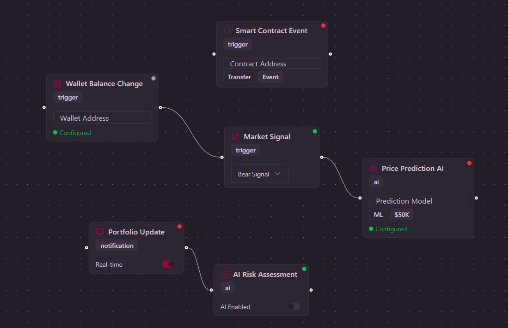

# NoditAuto - Blockchain Automation Platform

NoditAuto is a powerful visual blockchain automation platform that enables users to build sophisticated crypto trading and DeFi workflows using drag-and-drop blocks. Built with NODIT MCP integrations, it provides an intuitive interface for automating complex blockchain operations without writing code.

### Example Workflows

Here is an example of a workflow built using TaskWeave:



## 🚀 Features

### **Smart Trading Automation**

- Execute trades automatically based on price alerts and technical indicators
- AI-powered trading signals and market sentiment analysis
- Stop-loss and take-profit logic with risk management
- Multi-exchange support (Binance, Coinbase, Uniswap, etc.)

### **DeFi & Portfolio Management**

- Automated portfolio rebalancing
- Yield farming optimization
- Liquidity pool management
- Cross-chain bridge operations

### **Blockchain Monitoring**

- Smart contract event tracking
- Transaction detection and filtering
- Wallet balance monitoring
- Gas price optimization

### **Multi-Chain Support**

- Ethereum, BSC, Polygon, Arbitrum
- Cross-chain arbitrage detection
- Unified interface for all networks

## 🛠 Technology Stack

- **Frontend:** Next.js 14 with TypeScript
- **UI Components:** Shadcn UI + Tailwind CSS
- **Workflow Engine:** React Flow for visual workflow building
- **Blockchain Integration:** NODIT MCP (Model Context Protocol)
- **State Management:** React hooks and context
- **Styling:** Tailwind CSS with custom design system

## 📋 Block Categories

### **Triggers**

- 🔔 Price Alerts
- 📦 Block Confirmations
- 🔍 Transaction Detection
- 📜 Smart Contract Events
- 💰 Wallet Balance Changes
- 📊 Market Signals
- ✅ Order Fills
- ⛽ Gas Price Thresholds

### **Actions**

- 📈 Execute Trades
- 💸 Send Transactions
- 🚀 Deploy Contracts
- 📋 Place/Cancel Orders
- 🔄 Transfer/Stake/Swap Tokens
- 🌉 Bridge Tokens
- 🎁 Claim Rewards

### **Logic & Control**

- 📊 Price Comparisons
- ⚖️ Portfolio Rebalancing
- 🛑 Stop Loss Logic
- 🎯 Take Profit Logic
- 🔄 Arbitrage Detection
- ⚠️ Risk Assessment

### **Data Transform**

- 🧮 Price Calculators
- 📈 Portfolio Analysis
- 📊 Technical Indicators
- ⛽ Gas Optimization
- 💱 Token Conversion
- 💹 P&L Calculations

### **Storage & Tracking**

- 📚 Transaction History
- 📊 Portfolio Tracking
- 📝 Trade Logs
- 📈 Performance Metrics
- 💾 Wallet Backup

### **AI & Intelligence**

- 🤖 AI Trading Signals
- 😊 Market Sentiment Analysis
- 🔮 Price Prediction
- ⚠️ AI Risk Assessment
- 🎯 Pattern Recognition

### **Notifications**

- 🚨 Trade Alerts
- 💰 Price Notifications
- 📊 Portfolio Updates
- ⚠️ Risk Warnings
- ⛽ Gas Price Alerts

## 🚀 Getting Started

### Prerequisites

- Node.js 18+
- npm, yarn, or pnpm
- Git

### Installation

1. **Clone the repository**

```bash
git clone https://github.com/yourusername/noditauto.git
cd noditauto
```

2. **Install dependencies**

```bash
npm install
# or
yarn install
# or
pnpm install
```

3. **Run the development server**

```bash
npm run dev
# or
yarn dev
# or
pnpm dev
```

4. **Open your browser**
   Navigate to [http://localhost:3000](http://localhost:3000) to see the application.

## 📖 Usage Guide

### Building Your First Workflow

1. **Start on the Landing Page** - Learn about features and use cases
2. **Navigate to Project Builder** - Click "Get Started" or "Start Building"
3. **Drag Blocks from Library** - Choose from triggers, actions, logic, etc.
4. **Connect Blocks** - Create workflow by connecting block outputs to inputs
5. **Configure Each Block** - Set parameters, API keys, and conditions
6. **Test & Deploy** - Validate workflow and activate automation

### Example Workflows

Here is an example of a workflow built using TaskWeave:


**Simple Price Alert:**

```
Price Alert (BTC > $50,000) → Trade Alert (Push Notification)
```

**Automated Trading:**

```
Market Signal (Bullish) → Risk Assessment → Execute Trade (Buy BTC) → Portfolio Update
```

**DeFi Yield Farming:**

```
Yield Monitor → Compare Rates → Stake Tokens → Claim Rewards → Portfolio Tracker
```

**Portfolio Rebalancing:**

```
Schedule Trigger (Daily) → Portfolio Analyzer → Rebalance Logic → Execute Trades
```

### Wallet Integration

Connect your wallets through the configuration panel:

- MetaMask
- WalletConnect
- Coinbase Wallet
- Hardware Wallets (Ledger, Trezor)

## 🔧 Development

### Project Structure

```
noditauto/
├── app/                    # Next.js app router
│   ├── (mainapp)/
│   │   └── project/        # Main workflow builder
│   ├── page.tsx           # Landing page
│   └── layout.tsx         # Root layout
├── components/
│   └── ui/                # Shadcn UI components
├── hooks/                 # Custom React hooks
├── lib/                   # Utility functions
└── public/               # Static assets
```

### Available Scripts

```bash
npm run dev          # Start development server
npm run build        # Build for production
npm run start        # Start production server
npm run lint         # Run ESLint
npm run type-check   # Run TypeScript check
```

## 🛡️ Security

- **Non-Custodial:** Your private keys never leave your device
- **Open Source:** Full transparency and community audits
- **Risk Controls:** Built-in safeguards and position limits
- **Encrypted Storage:** All sensitive data is encrypted
- **Audit Trail:** Complete transaction and action logging

## 🤝 Contributing

We welcome contributions! Please see our [Contributing Guide](CONTRIBUTING.md) for details.

1. Fork the repository
2. Create a feature branch (`git checkout -b feature/amazing-feature`)
3. Commit changes (`git commit -m 'Add amazing feature'`)
4. Push to branch (`git push origin feature/amazing-feature`)
5. Open a Pull Request

**⚠️ Disclaimer:** This software is for educational and development purposes. Always test on testnets first and use at your own risk. Cryptocurrency trading and DeFi protocols involve significant financial risk.
